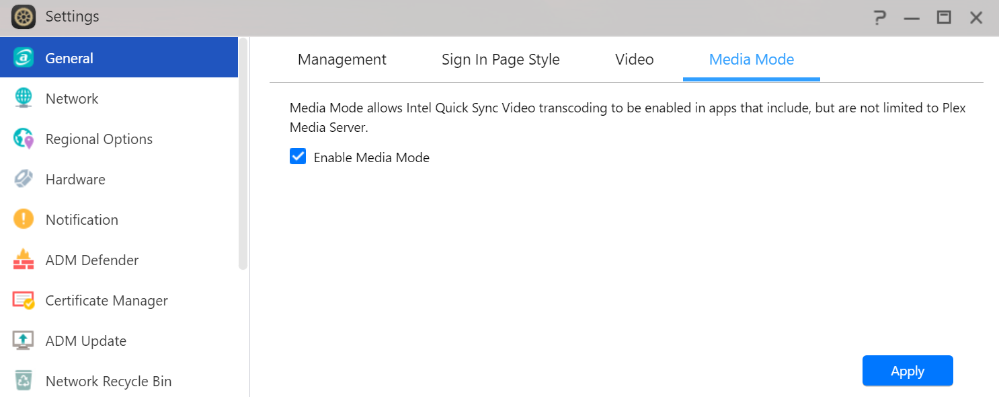

# Flashstor Server
 <br />
Structure to manage docker containers on a Asustor Flashstor NAS using compose .yaml files. <br /> <br />
For applications like Portainer and Jellyfin you can decide when and what version you update to.  You are not reliant on the application maintainer in ADM. <br />

## Setup
1. From App Central install `Docker Engine`, `Perl`, `Git`, and `nano`.
2. Create a share on the NAS called `server`.
3. Clone this git repository to the share called `server`.
4. To enable HW transcoding for apps such as Jellyfin or Frigate, make sure `Media Mode` is enabled. <br />


## Docker Containers
### Container Configuration
First make sure to configure any environment variables within the script `/docker/docker-env.sh`.  For example `TZ`. <br />

### Starting / Stopping Containers
To START a docker container, change into the folder of the container and type `../docker-start.sh v2`. <br />
To STOP a docker container, change into the folder of the container and type `../docker-stop.sh v2`. <br />
For example to start Jellyfin: <br />
```
cd /share/server/docker/jellyfin/
../docker-start.sh v2
```

### Folder Structure
The following directory structure is being followed: <br />
```
    .
    └── server
     └── docker
      ├── docker-env.sh      # common container environment variables
      ├── secrets            # common secrets
      └── [container_name]   # container - call scripts to START / STOP from here
       ├── docker-env.sh     # container specific environment variables
       ├── data             
       | ├── common          # persistent data - common across all hosts (e.g. config files)
       | └── host            # persistent data - specific to the host (e.g. databases)
       └── secrets           # container specific secrets
```
### Backup
Docker container that contain presistent writable data are stopped before backup.  `label docker-volume-backup.stop-during-backup=true` is set within the `docker-compose.yml` of the container to acheive this.
